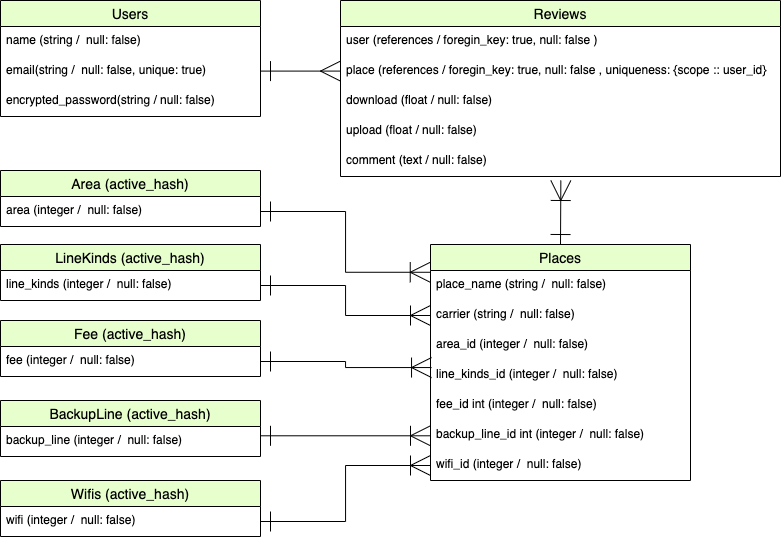

## アプリケーション名
### **「Evels Tokyo」**
Event Venue Line Speed Tokyoの略です。  
 

## アプリケーション概要
#### イベント主催者が利用したイベント会場のインターネットスピードの回線速度をレビュー投稿できるWebアプリです。
コンセプトは以下の2点です。
  - 複数のレビューを元に平均化された回線速度をイベント会場ごとに参考にする事ができます。
  - 自身の過去のレビューはマイページから確認でき、会場の利用記録として残すことができます。
 
 

## 目指した課題解決と開発背景
#### オンラインイベント運営にあたり、**「回線計測のために複数会場の下見をする」** という会場選定の手間を少なくすることを目指しました。  
 
オンライン・ハイブリットイベントの需要が多くなり、 
イベント運営の重要素として「ネットワーク回線速度」が求められる様になりました。 
会場選定中のイベント主催担当のお客様より、 会場付帯のネットワーク設備に関し度々こんな悩みをお聞きしました。 
 

- 会場に問い合わせしてもベストエフォートの数値が返ってくる為、実際には速度が出ず、トラブルにつながる
- 多くの会場より事前の回線速度の計測を推奨される  
- 回線計測の為に複数会場に下見に行く必要があり準備期間が多くとられる  
 

そのような悩みを少しでも減らしたいと思い、利用者の回線速度レビューができるWebアプリを開発しました。  
また自身の計測結果の記録を残せることで、再利用の際の参考にできるようにしました。  
 
## URL
[http://35.76.226.59/](http://35.76.226.59/)
## テスト用アカウント
- ID: `test1@test.com`
- PW: `111aaa`
## 利用方法
- 会場新規登録方法
  - テストアカウントでログインし、ヘッダー「会場登録」ボタン押下すると会場登録ページへ遷移します。  
  会場の情報を入力し、「登録する」ボタンを押下することで会場が登録されます。
- エリア絞り込み機能
  - トップページの「AREAS」より選択したエリアのみの会場が表示されます。
- 回線速度レビュー投稿機能
  - 会場の画像またはタイトルを押下すると、会場詳細ページへ遷移します。 
「レビューする」ボタンを押下しレビュー投稿画面より必要情報を入力することでレビュー投稿が可能です。
 

## 要件定義
| 優先順位 （高:1、中:2、低:3） | 機能           | 目的                                                                                    | 詳細                                                                                                                            | ストーリー (ユースケース)                                                                  | 見積もり （所要時間） |
|------------------------|-------------------|---------------------------------------------------------------------------------------|-------------------------------------------------------------------------------------------------------------------------------|-------------------------------------------------------------------------------------|-----------------|
| 1                      | ユーザー登録 ログイン機能 | マイページ実装の為、 ユーザーごとにユニークなアカウントが必要となる為                                               | ・ユーザー登録ができる ・登録情報よりログインができる                                                                                               | ・ID、パスワードを設定し登録ボタンを押す事で ユーザー登録ができる ・登録したID、パスワ―ドよりログインボタンを押すことで ログインできる | 15H             |
| 1                      | マイページ機能           | マイページよりユーザーごとに、 過去の自身のレビューを確認できるようにする為                                            | ・マイページから情報投稿した会場の詳細ページへ遷移できる                                                                                                  | ・ログイン状態でマイページ遷移ボタンより、 自身の過去のレビュー投稿を確認できる                                        | 10H             |
| 1                      | 会場追加機能            | ユーザー自身で会場を追加できるようにする為                                                                 | ・新たに会場を追加できる ・以下の情報を登録をしなければならない ①会場名②地域(都内)③キャリアー④料金形態 ⑤予備回線の有無⑥占有・共有回線⑦Free Wifiの有無                             | ・会場の必要な情報を入力し、会場追加ボタンより追加ができる                                                       | 15H             |
| 1                      | 会場一覧表示機能          | ・トップページに会場が表示されることで ユーザーが詳細ページへアクセスしやすくする為 ・トップページからwebアプリケーションの趣旨を伝える為       | ・登録された会場名・情報が表示 ・レビュー投稿があれば、平均回線速度を表示 ・レビュー投稿がなければ、レビューを促す表示をする                                                       | ・トップページに遷移すると新しく登録されて会場順に会場が表示される                                                   | 10H             |
| 1                      | 会場詳細表示            | 会場ごとのより詳細な情報を表示する為                                                                    | ・会場の詳細情報を見る事ができる ・登録されている写真 ・投稿された回線速度の平均値 ※Upload,Download                                                       | ・会場の名前または写真を押下することで詳細表示をすることができる                                                    | 4H              |
| 1                      | レビュー投稿機能          | ユーザーが会場の回線速度などのレビューを可能とする                                                             | ・会場に紐ついた回線速度・写真・コメントでレビューができる ・ログインユーザーはレビューができる ・１つの会場につき１人のユーザーは１つしかレビューできない ※連投が起こった場合、回線速度の平均値の正当性がなくなる為  | 必要な情報を入力し、投稿ボタンより投稿ができる                                                             | 15H             |
| 2                      | レビュー編集機能          | 新しい情報や情報自体に誤りがあった場合編集を可能とする為                                                          | 自身で投稿したレビューの編集ができる                                                                                                            | 自身の投稿済みのレビューは編集ボタンより編集ができる                                                          | 4H              |
| 2                      | レビュー削除機能          | 新しい情報や情報自体に誤りがあった場合など削除を可能とする為                                                        | 自身で投稿したレビューの削除ができる                                                                                                            | 自身の投稿済みのレビューは削除ボタンより削除ができる                                                          | 4H              |
| 2                      | エリア検索機能           | トップページから地域をしぼってさせる為                                                                   | ・エリア検索 ・ホテル、イベント会場は都心に集中している為、 選択肢を都内23区とする                                                                           | トップページの任意の地域（都内）を押下することで、 指定地域のみの会場が表示される                                       | 10H             |
| 2                      | レシポンシブデザイン化(実装中)       | 使用デバイスにとらわれないUIとする為                                                                   | ・機能・フロント実装後、各デバイス画面ごとの メディアクエリをスタイルシートに記述                                                                                 | PC、タブレット、スマートフォンから利用しても操作性、見た目がなわれない。                                               | 10H             |
| 3                      | ワード検索機能(未実装)           | 目的の会場を検索しやすくする為                                                                       | ・ヘッダーにワード検索フォームを設ける                                                                                                           | 検索フォームに検索したいワードを入力し、検索ボタンを押すことで、関連する会場が表示される                                        | 2H              |
| 3                      | 回線計測環境表示(未実装)          | ・回線速度の計測環境を追加することができ、情報の精度を向上させる為。 ・ユーザー自身の利用実績の内容をより コメント項目以外で簡易に記録できるようにする為 | ・レビューに接続人数・接続時間帯・ping値が表示される                                                                                                  | ・レビュー投稿フォームより情報入力することで、表示に反映される                                                     | 6H              |
## 使用イメージ
### トップページ、会場詳細ページに平均の回線速度が表示され、 個々のレビューにはレビューごとの回線速度が表示されます。 詳細ページからレビューが可能です。  
  
### AREASから指定のエリアの会場を絞り込めます。  
  
### 自身のレビューはヘッダーのマイページから確認できます。そこから直接会場の詳細ページへ遷移可能です。  

## 実装予定の機能
- ビューのレシポンシブ化(実装中)
- ワード検索
- 回線速度の計測環境項目の追加(接続人数・時間帯・ping値等)

## データベース設計
### ER図
  

### 各テーブルについて
| テーブル名    | 説明                            |
| ------------| ----------                     |
| users       | ユーザー情報                     |
| places      | 会場情報                        |
| reviews     | レビュー情報                     |
| area        | 会場の場所情報(AcitveHash)        |
| line_kinds  | 会場の回線サービス情報(AcitveHash) |
| fee         | 会場の回線費用形態情報(AcitveHash) |
| backup_line | 会場の予備回線情報」(AcitveHash)   |
| wifi        | 会場のWifi情報(AcitveHash)       |

## ローカルでの動作方法
#### ターミナル操作
`$ git clone https://github.com/Kurikoko/evels-review.git`  
`$ cd evels-review`  
`$ bundle install`  
`$ yarn install`  
`$ rails db:create`  
`$ rails db:migrate`  
`$ rails s`  
http://localhost:3000

#### 使用技術
- フロントエンド
  - jquery 3.6.0
  - bootstrap 5.1.2
  - HTML/ Scss/ slick/ kaminari
- バックエンド
  - Ruby 2.6.5
  - Rails 6.0.4.1
  - Rspec-rails 4.0.0
  - ransack 

